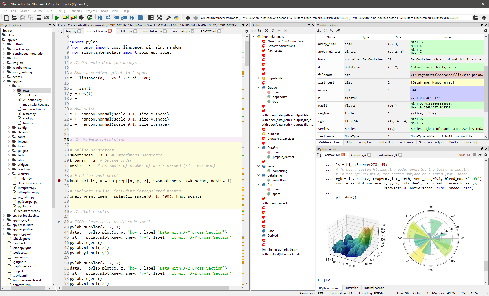

# **Python Programming**
## 01. Getting Started

Evan Chang

---

# About me - Evan Chang

* ~~NCTU~~ NYCU Computer Science Ph.D. Student
* Data Science / ML / DL
* Python / C / C++ / Java
* toosyou.tw@gmail.com

--- 

# What's Python


<- **Guido van Rossum** created it in _1989_.

**Python 2.0** _2000_ - _2020_
**Python 3.x** _2008_ - _now_

---

# What's Python


* **Beautiful** is better than ugly.
* **Explicit** is better than implicit.
* **Simple** is better than complex.
* **Complex** is better than complicated.
* **Readability** counts.

---

# What's Python


--- 

# What's Python


* Interpreted Language 直譯語言
  * No **Compile** required.
* Dynamic Typed Language 動態語言
  * Type checking in run-time.
  * i.e. type error might occur while executing.

---

# What's Python


* Easy to learn.
* Faster to develop.
* Cross-platform.
* **Free packages!**

---
<!-- _class: lead -->

# Pop Quiz:
# Python 2.0 是在哪一年發行的？

---

# Syllabus

1. Environment, Variable, Operation
2. Conditional Statement
3. Loop & Iteration
4. Data Container
5. Functions
6. More Data Container
7. Team Match

---

# Scoring

* 5 HWs, one for each class.
  * 3 - 5 questions each.
  * Upload the source codes to [NYCU E3](https://e3.nycu.edu.tw/).
  * TA will help.

* Team match
  * ~50 people a team
  * ~100 questions
  * Easy / Medium / Hard

---


---

# Installation


* **Anaconda**
  * Your data science toolkit
  * https://www.anaconda.com/products/individual
    * Python 3.9, 64-Bit Graphical Installer (4xx MB)
    *  > `Anaconda3 (64-bit)` > `Anaconda Navigator`
    * `Spyder`

---


---



---

# Spyder

* **IDE** for python
  * **I**ntegrated **D**evelopment **E**nvironment
    * 整合開發環境
  * Where to edit and run codes


---

# Hello, World!

1.  New File
2. `print('Hello, World!')`
3. Ctrl+s to save the program (you could name it `hello_world.py`)
4. Run 
5. See the output in the bottom right panel!
6. ~~Now you know python~~

---

# How not to write code - comments

* Single-line comments start with `#`
* Multiple lines comments start and end with `'''` or `"""`
* Computer won't see comments. Write whatever you want!
  ```python
  # This is a single line comment
  '''This is a
      multiple lines comment
  '''
  """ so is this one """
  ```

---

# Constants

* `'Hello, World!'` is a `str`, string 字串 **constant**
  * `'str'`, `"str"`, `'''str'''` and `"""str"""` are all the same in python
  * Try it!
    ```python
    print('Hello, Wrold!')
    print("Hello, World!")
    print('''Hello, World!''')
    print("""Hello, World!""")
    ```

---

# Constants
* But how to print single/double quote?
  * `print("single quote:'")` and `print('double quote:"')` works
  * `print('\'')` and `print("\"")` also works
* Special Characters
  * Tab: `\t`
  * Newline: `\n`
  * Beep: `\a`

---

# Constants

* Numerical **constants**
  * `int`, Integer 整數 constant: `420`
  * `float`, Float 浮點數 constant: `199.87`
  * `7e10` means $7 \times 10^{10}$
  * Try it!
    ```python
    print(123)
    print(321.1234567)
    print(9.99e9)
    ```

---

# Arithmetic

* `+ - * /`: `print(1 + 2 / 3)` -> `1.6666666666666665`
* `//` integer division 整數除法: `print(10 // 3)` -> `3`
* `%` modulus 取餘數: `print(10 % 3)` -> `1`
* `**` power: `print(2 ** 10)` -> `1024`

---

# Operator Precedence Rule

1. Parenthesis `()`
2. Power `**`
3. Multiplication, Division, Modulus `*/%`
4. Addition & Subtraction `+-`
5. Left to right

---
<!-- _class: lead -->

# Pop Quiz: 
# `x = 3 + 4 ** 2 / 4 % ( 2 + 1 )`

---

# Variables

* Object with a name that stores data
  * You could choose the name, ~~choose wisely.~~
  * Variables can be reassigned too.
  * Use single `=` to assgin values to variables.
    ```python
    a = 'Hello,'
    b = 69
    c = 10
    c = b / c
    print(a, b, c) # Hello, 69 6.9 
    ```
    * what's the value of `c`?

---

# Variable Names

* Must start with a letter or underscore `_`
* Only letters, numbers and underscore `_`
  * :x: : `2people`, `#sign`, `varable.123`
* Case sensitive 大小寫有差
  * `Sign`, `sign` and `SiGn` are all different variables
* No python keywords
  
---

# Python Keywords

```
False	def	if	raise
None	del	import	return
True	elif	in	try
and	else	is	while
as	except	lambda	with
assert	finally	nonlocal	yield
break	for	not	
class	from	or	
continue	global	pass
```
---

# `print`

* Print multiple things at once.
  ```python
  a = 420
  b = 10
  c = a / b
  print(a, 'divided by', b, '=', c) # 420 divided by 10 = 42.0
  ```
  * `a`, `'divided by'`, `b`, `'='` and `c` are arguments 引數 for `print`
  * Note that they are separated by a space.

---

# `print` arguments

* Pass `sep` argument to use different separator.
  ```python
  print(10, 20, 30, sep=', ') # 10, 20, 30
  print(10, 20, 30, sep='\t') # 10      20      30
  ```
* `end` argument to change the ending string.
  ```python
  print(10, 20, 30, end='')
  print(40, 50, 60)
  # 10 20 3040 50 60
  # why?
  ```

---

# `input(prompt_str)`

* Ask the user to input something to the console
  * End with an `Enter`
    ```python
    name = input('Tell me your name:')
    age = input('And your age:')
    print("You're", name, "(", age, ")") # You're Evan ( 18 )
    ```
  * However
    ```python
    print(age + 1) # TypeError: can only concatenate str (not "int") to str
    ```
    * Why?
  
---

# Type Conversion

* `type` will return what type the variable is
  ```python
  print(type(age)) # <class 'str'>
  ```
  * Since `input` return `str`
* Use `int()` to convert object to Integer
  ```python
  age = int(age) # convert to Integer
  print(age + 1, type(age)) # 19 <class 'int'>
  ```
---

# Type Conversion

* Convert it right after `input`
  ```python
  age = int(input('Tell me your age:'))
  print(age + 1)
  ```
  * :warning: Conversion might fail if decimals or texts are inputted.
* Convert to float -> `float()`
* Convert to string -> `str()`
* You get the idea.

---

# Type Conversion

* Integer conversion won't round up
  * `int(3.999)` -> `3`
  * `int(-3.999)` -> `-3`
* `str` convert numbers to strings of number
  * `str(-42)` -> `'-42'`
  * `str(3.999)` -> `'3.999'`

---

# Arithmetic Assignment Operators
* Combine arithmetic operations with assignments
  * `a = a + b` -> `a += b`
  * `a = a - b` -> `a -= b`
  * `a = a * b` -> `a *= b`
  * `a = a / b` -> `a /= b`
  * `a = a % b` -> `a %= b`
  * `a = a ** b` -> `a **= b`
  * `a = a // b` -> `a //= b`

---
<!-- _class: lead -->

# Pop Quiz: 
# 「12345679」猜四個字

---

# Arithmetic Assignment Operators
* Combine arithmetic operations with assignments
  * :warning: The followings are not valid syntax.
    ```python
    a += a += 1
    a += (b += 1)
    ```

---

<!-- _class: lead -->

# Exercises


---

# 1. Bocchi the maid

* 我們的好朋友波奇不小心當了女僕咖啡廳的員工，
  請幫幫她施展讓食物變好吃的魔法吧
* 打開  `Spyder`，使用 `print` 印出 `萌ㄟ萌ㄟ啾`


---

# 2. 不要再打了

* 知名拳擊手 Tozy 在近期的表演賽中，慘遭對手重擊
* 於心不忍的你於是決定叫對手不要再打了

1. 使用 `input` 輸入對手名字，存入變數 `muscular_man`
2. 使用 `print` 印出 `{muscular_man} 不要再打了`
   * e.g. `肌肉棒子 不要再打了`


---

# 3. 性別市場的最後 winnner

* 為了成為性別市場的最後 winner
* 你花了 10150 元買了一瓶潘海利根的香水
* 但你只有四種硬幣（50, 10, 5, 1）可以付錢
* 請寫一個程式幫你找出某金額最少要付幾個硬幣吧
```
輸入：10150
輸出： 50 * 203
      10 * 0
       5 * 0
       1 * 0
```

 

---

# 4. 新的壽司口味

* 最近連鎖壽司店推出的新壽司口味：「唾液」
* 但你實在不喜歡，因此你決定改吃三角御飯糰
* 寫一個程式使用飯糰的三個邊長，計算出三角形御飯糰的面積吧
$$
\triangle = \sqrt{s(s-a)(s-b)(s-c)}, s =\frac{a + b + c}{2}
$$
```
輸入：3↵ 4↵ 5↵
輸出：6
```


---

# Acknowledgment

* Prof. Chang-Chieh Cheng. National Yang Ming Chiao Tung University, Taiwan
* [Python for Everybody](https://www.py4e.com/)