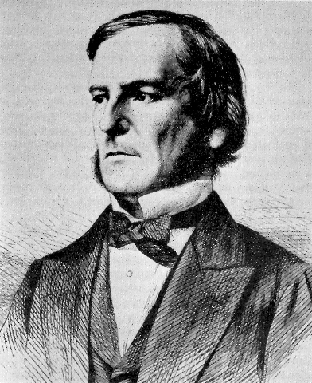

# **Python Programming**
## 02. Conditional Statements

Evan Chang

---

# Conditional Statements?


* Bring an umbrella if it rains.
* Fat if 起Ｏ雞
* ~~Skip classes if they're boring.~~

---

# Boolean Values



* Only two possible values: `False` and `True`
* Use `bool()` to convert a variable to a boolean variable
  * `0`, `None` or empty -> `False`
  * otherwise -> `True`
  ```python
  eat_cheogajip     = True
  become_slim       = bool(0)           # False
  become_slim       = bool(None)        # False
  become_fat        = bool(999)         # True
  but_it_feels_good = bool('False')     # True
  ```

---

# Comparison Operators

* `>`, `<` Greater/Less than
* `>=`, `<=` Greater/Less than or equal to
* **`==` Equal to** & **`!=` Not equal to**

```python
x = 1
y = 2
print(1 == 1)   # True
print(1 != 2)   # True
print(1 >= 2)   # False
```

---

# Comparison Operators

* `a < x < c` is equivalent to `a < x and x < c`

```python
print(x < y)      # True
print(3 > y > x)  # True
print(-1 < x < 1) # False
```

* How about these two?

```python
z = (x == y)      # False
z = x == y        # ?
```

---

### Operator Precedence

```python
1. :=
2. lambda
3. if – else
4. or
5. and
6. not x
7. in, not in, is, is not, <, <=, >, >=, !=, ==
8. |
9. ^
10. &
11. <<, >>
12. +, -
13. *, @, /, //, %
14. +x, -x, ~x
14. **
14. await x
15. x[index], x[index:index], x(arguments...), x.attribute
16. (expressions...), [expressions...], {key: value...}, {expressions...}
```

---

# Operator Precedence

* Higher precedence operators are evaluated first

```python
z = x == y           # False
print(2 ** 3 * 5)    # 40
```

---
<!-- _class: lead -->

# Pop Quiz: 
# 什麼變數型態只有 `True` 或 `False`?

---

# Logical Operators

* `not x`, return `True` if x is `False`
* `x and y`, return `True` if x and y are both `True`
* `x or y`, return `False` if x and y are both `False`

```python
eat_cheogajip = True
eat_KFC = True
become_slim = not (eat_cheogajip or eat_KFC) # False

print((eat_cheogajip or eat_KFC) and become_slim) # False
```

---

# Logical Complements

* `not (x and y) == (not x) or (not y)`
* `not (x or y)  == (not x) and (not y)`

---

### Operator Precedence

```python
1. :=
2. lambda
3. if – else
4. or
5. and
6. not x
7. in, not in, is, is not, <, <=, >, >=, !=, ==
8. |
9. ^
10. &
11. <<, >>
12. +, -
13. *, @, /, //, %
14. +x, -x, ~x
14. **
14. await x
15. x[index], x[index:index], x(arguments...), x.attribute
16. (expressions...), [expressions...], {key: value...}, {expressions...}
```


---

# Logical Complements

* Venn Diagram (文氏圖)
    
  
---

<!-- _class: lead -->

# Pop Quiz: 
#### `( (True and False) or (not (False or False)) ) and True`

---

# Identity Operators
* `x is y` return `True` if `x` and `y` is the same object.
* There's also `x is not y` for checking if they are different objects

```python
x = 3
y = 4
print(x is y)       # False
print(x is not y)   # True
print(not(x is y))  # True
```

---

# Identity Operators
* **However**, python creates one object for each number in [-5, 256].
* But not for number < -5 or > 256

```python
a = 10
b = 10
x = 257
y = 257

print(a is b, x is y)     # True False, why?
```

---

# Identity Operators

* Default objects
```python
a = 10
b = 10
c = a + 1
'''
                                        a
                                        |
                                        V
default objects: [-5][-4] ... [0] ... [10][11] ... [255][256]
                                        ^   ^
                                        |   |
                                        b   c
'''
```
---

# Identity Operators

* Not default objects
```python
x = 257
y = 257

'''
x -> [Integer with value 257]
y -> [Integer with value 257]
'''
```

* Takeaway: **DON'T compare integers by `is`**

---

# Identity Operators

* Something similar occurs when using `is` to compare `string`s

```python
a = 'AAAAA'
b = 'AAAAA'

x = 'cheogajip is good'
y = 'cheogajip is good'

print(a is b, x is y) # True False, why?
```
* [Why?](https://github.com/satwikkansal/wtfpython?fbclid=IwAR3nXrCEFisfEMhVU5WTcLcOEFN7LQlicVAiy1V3YdXRMVl5fw9p_1MwhPo#-strings-can-be-tricky-sometimes)
* Takeaway: **DON'T compare strings by `is`**

---

# `if` statement

* Do something `if` the condition is `True`
* Syntax
  ```python
  if some_condition:
      indented_statements
  ```
* Example
  ```python
  dinner = input('What do you want to eat? ')
  if dinner == 'cheogajip' or dinner == 'KFC':
      print('FAT!')
  ```

---

# `if` and `else`
* Do something if no conditions are `True` in `if`
* Syntax
  ```python
  if some_condition:
      indented_statements
  else:
      another_indented_statements
  ```

---

# `if` and `else`
* Do something if no conditions are `True` in `if`
* Example
  ```python
  dinner = input('What do you want to eat? ')
  if dinner == 'cheogajip' or dinner == 'KFC':
      print('FAT!')
  else:
      print('Good!')
  ```

---

# `if`, `elif` and `else`

* `elif` stands for `else` + `if`
* Syntax
  ```python
  if some_condition:
      indented_statements
  elif another_condition:
      another_indented_statements
  else:
      yet_another_indented_statements
  ```

---

# `if`, `elif` and `else`

* Example
  ```python
  dinner = input('What do you want to eat? ')
  if dinner == 'cheogajip' or dinner == 'KFC':
      print('FAT!')
  elif dinner == 'chicken breast':
      print('Excellent!')
  else:
      print('Good!')
  ```

---

# `if`, `elif` and `else`

* Example - scoring system

```python
score = int(input('Input Score: '))           #    start
if score >= 90:                               #      ↓
    print('A!')                               # [score >= 90?]  -> A!
elif score >= 70:                             #      ↓
    print('B!')                               # [score >= 70?]  -> B!
elif score >= 60:                             #      ↓
    print('C!')                               # [score >= 60?]  -> C!
else:                                         #      ↓
    print('F!')                               #      F!
```

---

# Nested `if`, `elif` and `else`

```python
teacher_nice = input('Is the teacher nice? ') #   start
score = int(input('Input Score: '))           #     ↓
if teacher_nice == 'yes':                     # [teacher_nice == 'yes'] -> A++!
    print('A++!')                             #     |
else:                                         #     L -> [score >= 90?]  -> A!
    if score >= 90:                           #                ↓
        print('A!')                           #          [score >= 70?]  -> B!
    elif score >= 70:                         #                ↓
        print('B!')                           #          [score >= 60?]  -> C!
    elif score >= 60:                         #                ↓
        print('C!')                           #                F!
    else:
        print('F!')
```

---

<!-- _class: lead -->
# [Read More](https://www.youtube.com/watch?v=dQw4w9WgXcQ)

---

# `try` and `except`

* Sometimes codes will give us errors.
  ```python
  x = 'not an integer'
  x = int(x)
  '''
  Traceback (most recent call last):
    File "<stdin>", line 1, in <module>
  ValueError: invalid literal for int() with base 10: 'not a integer'
  '''
  ```
* How to prevent programs from crashing?

---

# `try` and `except`
* Syntax
    ```python
    try:
        do_something
    except SomeException:
        handle_exception
    ```
* `ValueError` is one type of build-in exception.
  * Also `KeyError`, `IndexError`, `KeyboardInterrupt`, `ZeroDivisionError` ...etc.

---

# `try` and `except`

* Example
  ```python
  weight = input('Input your weight: ')
  try:
      weight = int(weight)
      print('You weight', weight, 'kg')
  except ValueError:
      print('Input Integer plz!')
  ```

---

# `try` and `except`

* Catch multiple exceptions
  ```python
  try:
      cost = int(input('Dinner, how much? '))
      n_people = int(input('People, how many? '))
      print('Each should pay', cost / n_people)
  except ValueError:
      print('Please input integers!')
  except ZeroDivisionError:
      print('There is no one ????')
  ```

---

# `try` and `except`

* How to find the correct exception?
  * Try it and see the error messages!
* Too lazy? Simply ignore it!
  ```python
  try:
      int('Not a integer')
  except:
      print('Oops, there is something wrong!')
  ```
  * This catches every exception.
    * However, it may reduce **readability** and **reliability**.

---

# :warning: Indentation :warning:

* Python **cares** about indentation.
  * Inconsistent indentation might causes problems.
    ```python
    if True: # always proceed
        print('Ahoy!Ahoy!Ahoy!Ahoy')  # 4 spaces
      print('踊るAhoy!に見るAhoy!')     # 2 spaces
    '''
      File "test.py", line 3
    print('踊るAhoy!に見るAhoy!')     # 2 spaces
                                         ^
    IndentationError: unindent does not match any outer indentation level
    '''
    ```
---

# :warning: Indentation :warning:

* Python **cares** about indentation.
  * Mixing `Tab ↹` and 4 `Space`s also causes problems.
    * And you can't even see it.
    * Modern IDEs prevent this by replace `Tab ↹` with 4 `Space`s automatically.

---

<!-- _class: lead -->
# Exercises

---

# 1. 蛋餅不加蛋


* 最近不流行吃蛋了，於是你決定把早餐的蛋餅都改成薯餅了
* 寫一個程式把菜單上的蛋餅都改成薯餅吧
  * 輸入兩個字串，將 `蛋餅` 字串改成 `薯餅` 再印出來吧
  ```
  輸入：培根↵ 蛋餅↵
  輸出：培根↵ 薯餅↵
---

# 2. 貳拾茶屋


* 知名飲料職人 TOZY 的店還剩下 `n` 分鐘就要打烊了
* 而有著精湛的手藝的他，每 `k` 分鐘就可以搖出一杯珍珠鮮奶茶
* 請輸入兩個整數 `n` 跟 `k` 計算出總共可以搖出幾杯珍珠鮮奶茶吧

---

# 3. 貳拾茶屋 2


* 來抓違建的建管處員工看到了你寫的程式
* 調皮的他先是將 `k` 值輸入成了 `0`，又試了非數字的輸入
* 兩次都讓你的程式壞掉了
* 使用 `try` 跟 `except` 保護你的程式，讓兩次錯誤可以印出對應的提示吧

---

# 4. 艾爾登把你壓在地上打環


* 你覺得最近的新遊戲「艾爾登把你壓在地上打環」太簡單了
* 因為你發現了幾種關鍵的條件，滿足任一種即可通關：
  1. `練習時間大於或等於 500 小時，且角色強度大於三倍boss強度`
  2. `練習時間小於 500 小時，且遊戲沒有掉幀`
  3. `當天氣溫高於 50 度，且降雨量大於 100 公分`
* 輸入各項數據判斷是否可以通關吧

---

# 5. 停電週期


* 最近皮卡丘常常發不出電來，而你發現了是因為閏年的關係
* 寫個程式判斷今年年份 $Y$ 是不是閏年吧
  * 閏年規則：
    1. $Y$ 非 $4$ 的倍數 -> 平年
    2. $Y$ 為 $4$ 的倍數，但非 $100$ 的倍數 -> 閏年
    3. $Y$ 為 $100$ 的倍數，但非 $400$ 的倍數 -> 平年
    4. $Y$ 為 $400$ 的倍數 -> 閏年
* [提示](https://www.youtube.com/watch?v=6Rm-eZ8rwYU&feature=emb_imp_woyt)


---


# Acknowledgment

* Prof. Chang-Chieh Cheng. National Yang Ming Chiao Tung University, Taiwan
* [Python for Everybody](https://www.py4e.com/)